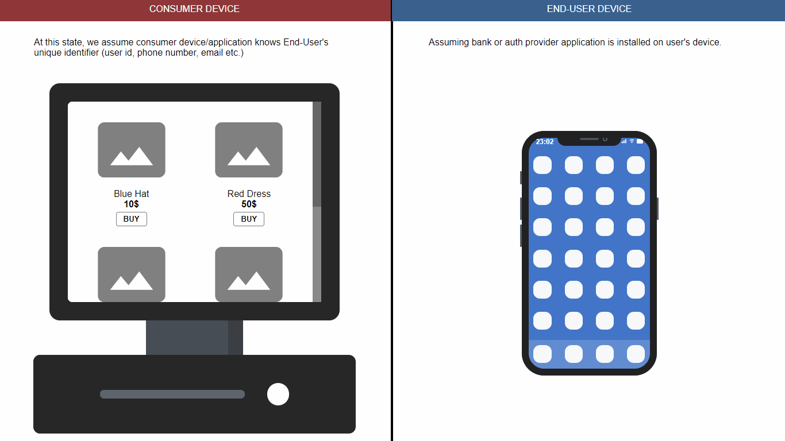
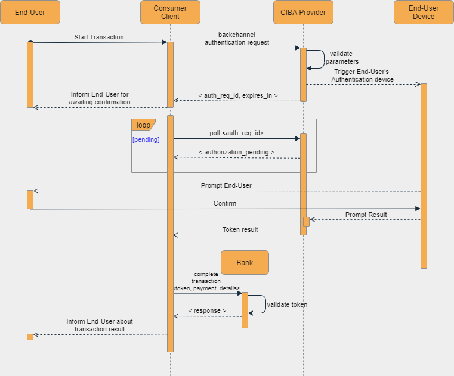

## CIBA Playground


This is a demonstration of how OpenID CIBA works on a simple use case. 

> **DISCLAIMER:**
> This project is **NOT** production grade. To simplify implementation, some functions handled at client side which **SHOULD NOT** be the same in real world applications. 

Image below demonstrates the flow. To decrease complexity, error cases are excluded.


## Before you begin
Make sure you have configured/ensured your provider to have/is:
- CIBA support (w/ Poll mode)
- JWT for Client Authentication
- Public IP/Address for your environment or an [ngrok](https://ngrok.com/) account.

## Prerequisites
1) Create a client in your provider with:
   - `urn:openid:params:grant-type:ciba` grant type
   - `client_secret_jwt` token endpoint auth method

2) Configure your provider/auth service to trigger end-user device by making a `POST` request to `<YOUR_PUBLIC_ADDRESS>:<SERVER_PORT>/prompt_end_user`
with body containing `authRequest`. Have a look at [src/components/EndUser.vue:82](src/components/EndUser.vue:82)  

## Usage
Clone repository and install dependencies with
```shell
npm install
```

Create your environment file `.env` containing values according to your setup. Have a look at [.env.template](.env.template) file. Or you can set your values inside application, but they won't be stored.

Finally, execute run script
```shell
npm run start
```

Browse to application by given server configuration which defaults to [http://localhost:8801](http://localhost:8801)
